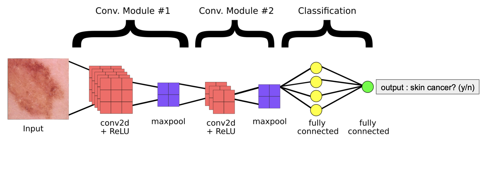

# Skin Cancer Detection with a From-Scratch CNN

This repository contains a notebook-based implementation of a Convolutional Neural Network built from scratch for skin lesion classification. It describes the full model pipeline: image preprocessing, convolution-style feature extraction, pooling, and a Scikit-Learn MLP-based classifier for binary prediction of lesions as benign or cancerous.

## What this project shows

The notebook demonstrates how core convolution-style modules can be implemented directly and how they contribute to a full CNN workflow. The project covers the complete pipeline:

- building custom convolution-style modules
- extracting and reducing image features
- combining learned features into a neural classifier
- performing binary classification on skin lesion images

The result is a transparent example of a CNN-style image classification pipeline from input images to final predictions.

## Why this is a strong project

- It shows I can understand and implement CNN building blocks directly.
- It demonstrates hands-on experience with image-based machine learning.
- It highlights my ability to go from raw image data to a working classification model.
- It connects technical skill with a real-world healthcare use case.

## Project goal

The goal of this project is to classify skin lesion images as either benign or cancerous using a CNN-style pipeline. This makes it a strong example of applying deep learning to a meaningful medical imaging problem.

## Tools used

- Python
- OpenCV
- NumPy
- Matplotlib
- scikit-learn

## Project files

- [ProjectFinalDraft.ipynb](ProjectFinalDraft.ipynb) — main notebook with the full workflow
- [cnn_skincancerDetectionImage.png](cnn_skincancerDetectionImage.png) — project preview image

## Documentation

The notebook documents the full model development process, including:

- dataset exploration and preprocessing
- custom convolution-style module implementation
- training and evaluation of the classification model
- performance analysis and visualizations

Read the notebook to see the step-by-step approach, code explanations, and results.

## How to run

1. Open [ProjectFinalDraft.ipynb](ProjectFinalDraft.ipynb) in Jupyter Notebook or VS Code.
2. Install the required dependencies:
   - `pip install opencv-python numpy matplotlib scikit-learn`
3. Run the notebook cells in order.
